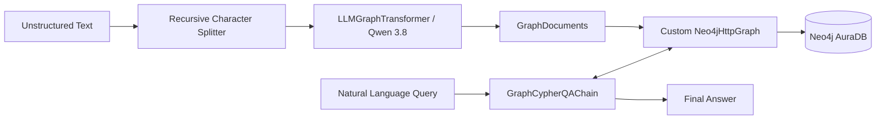

# Graph-RAG with Neo4j & LangChain

An end-to-end implementation of **Graph Retrieval-Augmented Generation (Graph-RAG)** using **Neo4j AuraDB**, **LangChain**, and **Groq (Qwen 3.8)**. This project demonstrates extracting structured knowledge graphs from unstructured text, indexing entities and relationships into Neo4j via the HTTP Query API, and orchestrating natural language question answering via Cypher queries using `GraphCypherQAChain`.

---

## Architecture Overview



### Key Workflow Stages

1. **Document Ingestion & Chunking**:
   - Plain text documents describing movies, directors, and actors are split using `RecursiveCharacterTextSplitter`.
2. **Graph Extraction**:
   - `LLMGraphTransformer` powered by Groq (`qwen/qwen3.8-27b`) extracts strictly typed nodes (`Person`, `Movie`, `Genre`) and explicit relationships (`DIRECTED`, `ACTED_IN`, `IN_GENRE`).
3. **Graph Storage & Ingestion (HTTP Query API)**:
   - A custom `Neo4jHttpGraph` adapter interfaces directly with Neo4j Aura's HTTP Query API (`/query/v2`).
   - Ingests nodes, relationships, and source document chunks (`Document` nodes) with bidirectional provenance links (`MENTIONS`).
4. **Schema Reflection & Dynamic Inspection**:
   - Generates and synchronizes LangChain-compatible structured graph schemas dynamically using `db.schema.nodeTypeProperties()` and `db.schema.visualization()`.
5. **Graph-RAG Retrieval & Natural Language Answering**:
   - `GraphCypherQAChain` translates natural language prompts into Cypher graph queries, executes them against Neo4j, and generates grounded synthesis with factual context.

---

## Project Structure

```text
├── graphrag.ipynb       # Main interactive notebook containing full pipeline execution
├── pyproject.toml       # Python dependencies and project metadata
├── uv.lock              # Reproducible dependency lockfile
├── .env.example         # Template for environment configuration
├── .gitignore           # Git ignore patterns for credentials and caches
└── README.md            # Technical documentation
```

---

## Prerequisites

- **Python**: `>= 3.13`
- **Neo4j AuraDB**: Active cloud database instance (URI, Instance ID, and Password)
- **Groq Cloud API Key**: For fast inference with Qwen/Llama models

---

## Environment Configuration

Create a `.env` file in the root directory (do not commit your credentials):

```ini
AURA_INSTANCEID=your_neo4j_instance_id
NEO4J_DATABASE=neo4j
NEO4J_PASSWORD=your_neo4j_password
GROQ_API_KEY=your_groq_api_key
```

---

## Installation & Setup

Using [`uv`](https://github.com/astral-sh/uv) (recommended):

```bash
uv sync
```

Or using standard `pip`:

```bash
python -m venv .venv
# On Windows:
.venv\Scripts\activate
# On Linux/macOS:
source .venv/bin/activate

pip install -r requirements.txt # or install pyproject dependencies
```

---

## Pipeline Execution Details

### 1. Custom HTTP Graph Driver (`Neo4jHttpGraph`)

A lightweight HTTP driver built over the Neo4j Query API `v2`, offering:
- Zero dependency on Bolt native binary protocol (firewall & serverless-friendly).
- Native integration with LangChain's `GraphCypherQAChain` via the `@property get_structured_schema` and `refresh_schema()` interfaces.
- Transactional `MERGE` statements for deterministic node/edge deduplication and provenance linking.

### 2. Knowledge Graph Schema

The pipeline populates a graph with the following schema:

- **Node Types**:
  - `Movie`: `{id: STRING}`
  - `Person`: `{id: STRING}`
  - `Genre`: `{id: STRING}`
  - `Document`: `{id: STRING, text: STRING}` (Source provenance)

- **Relationship Types**:
  - `(:Person)-[:DIRECTED]->(:Movie)`
  - `(:Person)-[:ACTED_IN]->(:Movie)`
  - `(:Movie)-[:IN_GENRE]->(:Genre)`
  - `(:Document)-[:MENTIONS]->(:Person | :Movie | :Genre)`

### 3. Querying & Evaluation

```python
# GraphCypherQAChain Execution
response = chain.invoke({
    "query": "Which movies did Christopher Nolan direct?"
})
print(response["result"])
# Output: "Christopher Nolan directed Inception, Interstellar, and The Dark Knight."
```

---

## Security & Best Practices

- **Strict Environment Isolation**: API keys and database credentials are fully externalized via `.env`.
- **Cypher Injection Mitigation**: Uses parameterized queries and schema-guided validation within LangChain's QA chain.
- **Traceability**: Retains raw source chunks via `Document` nodes with `MENTIONS` edges to ground all extracted facts.

---

## License

This project is open-source and available under the [MIT License](LICENSE).
